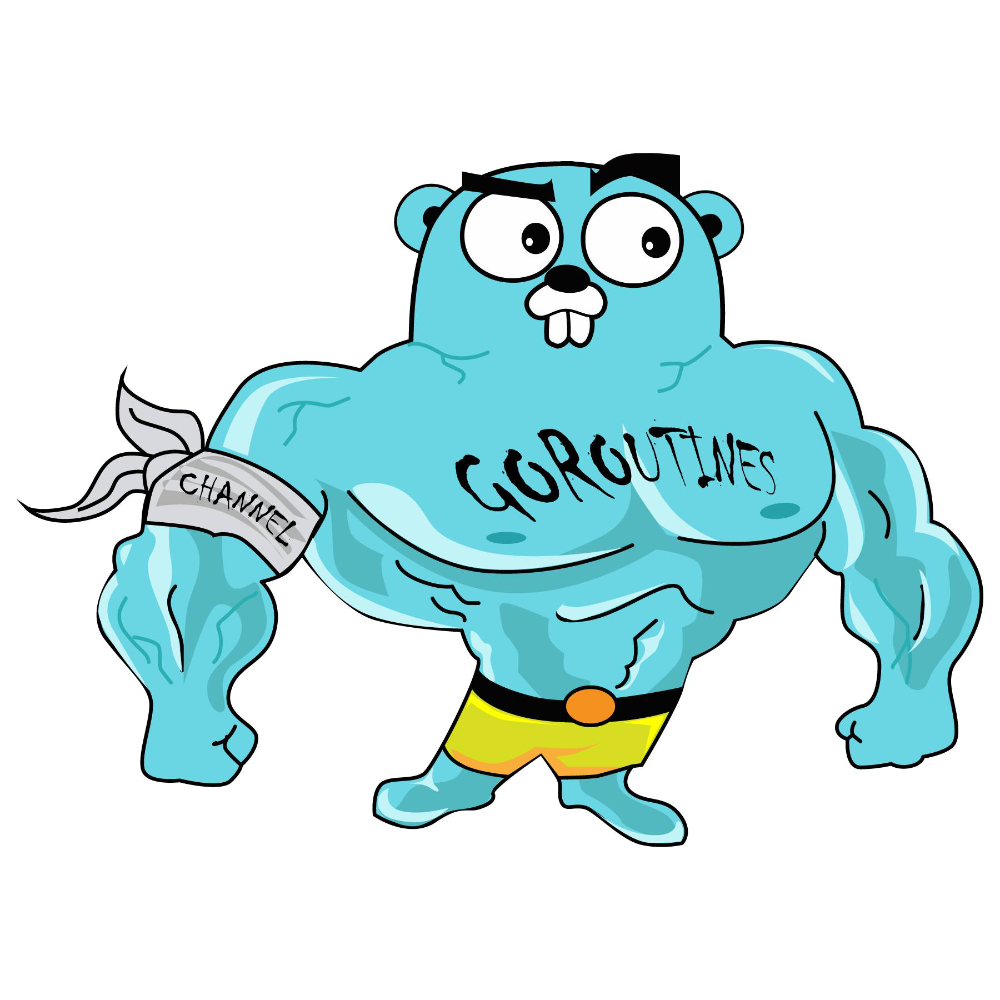

# File Server
Ladies and gentlemen, this is my first test assignment for a big tech company, and I have only 50% confidence that I understand what is being discussed. The remaining 50% is just confidence that I can convince you that everything is going according to plan :) I hope that at least the second half is correct! :)

This is Golang File Server including the following features:
*   made with Clean Architecture in mind (controller -> service -> repository)
*   has admin panel that visualize file system
*   made relatively fast :) but with :heart: :)

